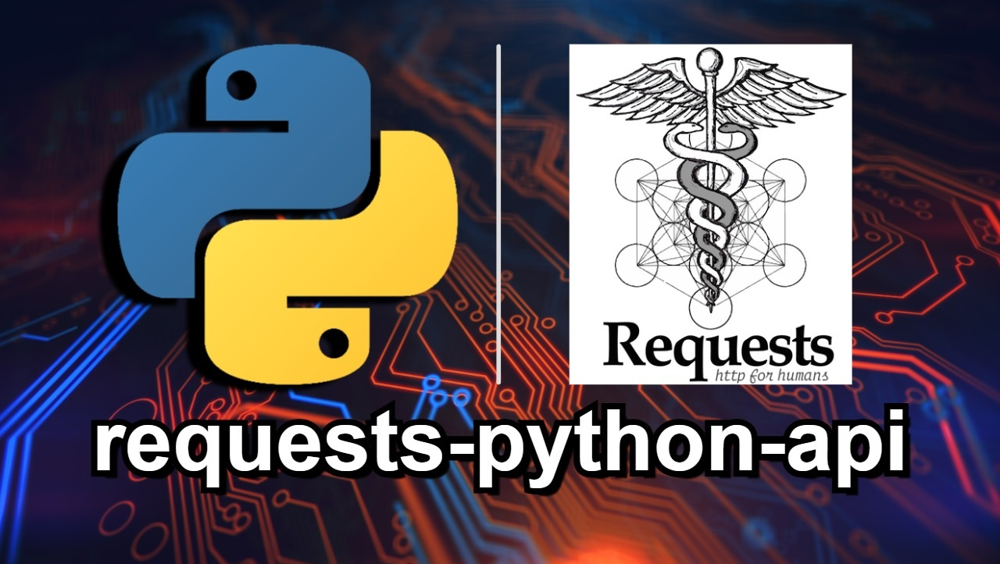
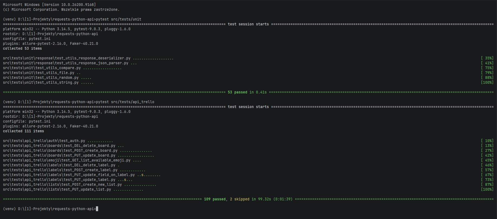
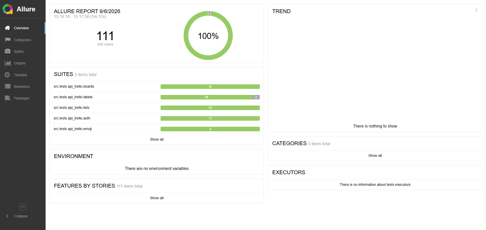
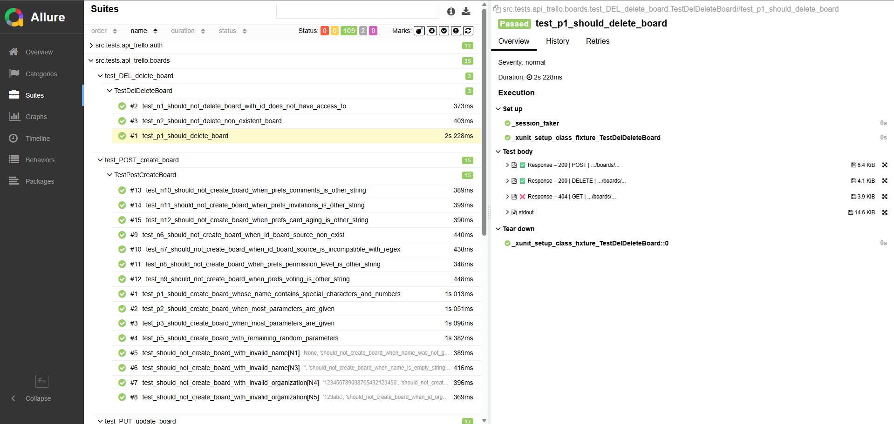
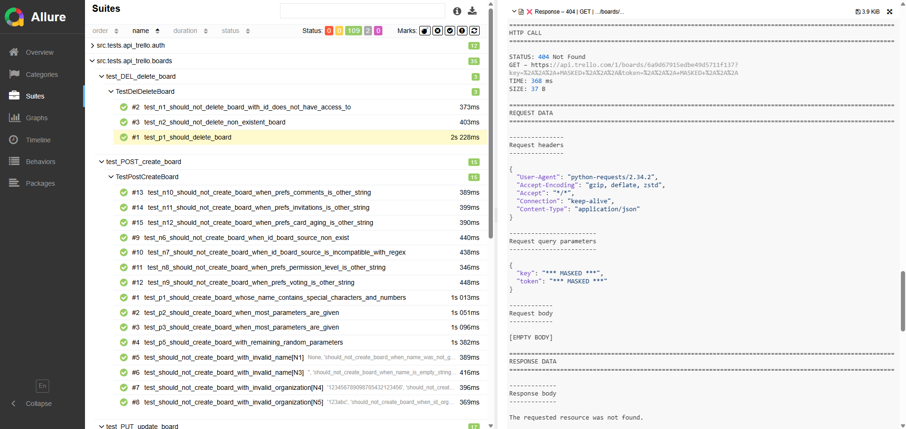
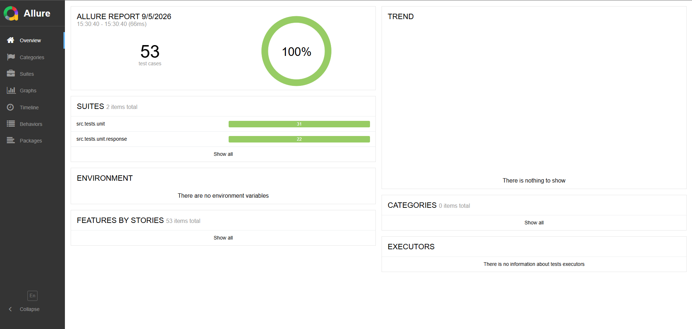
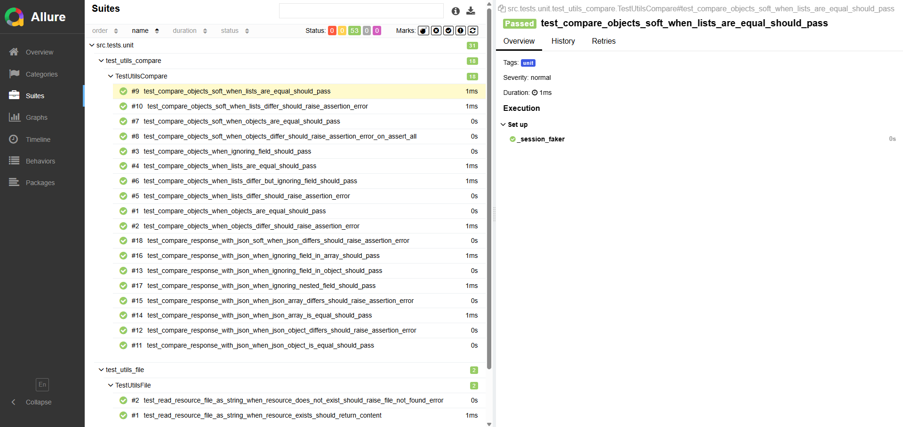

<div align="center">
  
</div>

# 📑Information about this repository (for recruiters)

## 📄Description

### 🙋‍♂️Introduction

Welcome to my repository, recruiters.  
Feel free to review its contents at your convenience.  
I'm a **software tester** and I created this repository to learn how to write **API tests** using `Python` and the `Requests` framework.

### 📦About repository

- This repository contains **API tests** using `Python` and the `Requests` framework
- I covered with tests **API** of the website **Trello**
- A list of things I learned are in the later sections of this document.

### 📌Additional notes

- Some of the comments in the repository are in Polish, so that when I come back to it, I can more easily remember and
understand what a given piece of code was about.
- There are also comments in English to explain to you (recruiters) what a given piece of code is about and why I wrote
a certain method/test this way and not another.

### 🫵Note for recruiters

- If any tests seem incomplete, outdated, or different from what is in the Trello documentation,
it may mean that the developers may have changed something over time and it's different from what I wrote the tests for.

## 🌐API covered with tests

[**Trello**](https://developer.atlassian.com/cloud/trello/rest/api-group-actions/#api-group-actions) – a web application
for managing kanban boards, created in 2011 by two programmers: Joel Spolsky and Michael Pryor.  
The software is currently managed and developed by Trello Enterprise – a subsidiary of Atlassian.

I won't copy here what mechanisms their API consists of. Everything is in the documentation, in the above URL.

## 📊Test Statistics

I know I could do more, but I also don't want to stay on this project too long because I also want to learn other
things/languages/technologies.

### Summary

| Tests type   | Quantity         | Average execution time |
|--------------|------------------|------------------------|
| API (Trello) | 109 (+2 skipped) | 96.31s (0:01:36)       |
| Unit tests   | 53               | 0.37s                  |

### Details (tests structure)

```
├───📁tests
│   ├───📁api_trello
│   │   ├───📂auth
│   │   │   ├───🐍test_auth.py
│   │   │   │   └───❌Negative: (12)
│   │   ├───📂boards
│   │   │   ├───🐍test_DEL_delete_board.py
│   │   │   │   ├───✅Positive: (1)
│   │   │   │   └───❌Negative: (2)
│   │   │   ├───🐍test_POST_create_board.py
│   │   │   │   ├───✅Positive: (4)
│   │   │   │   └───❌Negative: (11)
│   │   │   └───🐍test_PUT_update_board.py
│   │   │   │   ├───✅Positive: (4)
│   │   │   │   └───❌Negative: (13)
│   │   ├───📂emoji
│   │   │   └───🐍test_GET_list_available_emoji.py
│   │   │   │   ├───✅Positive: (3)
│   │   │   │   └───❌Negative: (1)
│   │   ├───📂labels
│   │   │   ├───🐍test_DEL_delete_label.py
│   │   │   │   ├───✅Positive: (1)
│   │   │   │   └───❌Negative: (0)
│   │   │   ├───🐍test_POST_create_label.py
│   │   │   │   ├───✅Positive: (5)
│   │   │   │   └───❌Negative: (7)
│   │   │   ├───🐍test_PUT_update_field_on_label.py
│   │   │   │   ├───✅Positive: (5)
│   │   │   │   ├───❌Negative: (5)
│   │   │   │   └───⏭️Skipped: (1)
│   │   │   └───🐍test_PUT_update_label.py
│   │   │   │   ├───✅Positive: (3)
│   │   │   │   ├───❌Negative: (3)
│   │   │   │   └───⏭️Skipped: (1)
│   │   └───📂lists
│   │       ├───🐍test_POST_create_new_list.py
│   │       │   ├───✅Positive: (6)
│   │       │   └───❌Negative: (9)
│   │       └───🐍test_PUT_update_list.py
│   │           ├───✅Positive: (7)
│   │           └───❌Negative: (7)
```

### Coverage and endpoint documentation

- 📁[documentation](documentation)
    - 📁[endpoints](documentation/endpoints)
        - 📂[boards](documentation/endpoints/boards)
            - 🐍[DEL_DeleteBoard.md](documentation/endpoints/boards/DEL_DeleteBoard.md)
            - 🐍[POST_CreateBoard.md](documentation/endpoints/boards/POST_CreateBoard.md)
            - 🐍[PUT_UpdateBoard.md](documentation/endpoints/boards/PUT_UpdateBoard.md)
        - 📂[emoji](documentation/endpoints/emoji)
            - 🐍[GET_ListAvailableEmoji.md](documentation/endpoints/emoji/GET_ListAvailableEmoji.md)
        - 📂[labels](documentation/endpoints/labels)
            - 🐍[POST_CreateLabel.md](documentation/endpoints/labels/POST_CreateLabel.md)
            - 🐍[PUT_UpdateFieldOnLabel.md](documentation/endpoints/labels/PUT_UpdateFieldOnLabel.md)
            - 🐍[PUT_UpdateLabel.md](documentation/endpoints/labels/PUT_UpdateLabel.md)
        - 📂[lists](documentation/endpoints/lists)
            - 🐍[POST_CreateNewList.md](documentation/endpoints/lists/POST_CreateNewList.md)
            - 🐍[PUT_UpdateList.md](documentation/endpoints/lists/PUT_UpdateList.md)

### Sample test steps (positive)

1. Resources from the `@pytest.fixture(scope="class", autouse=True)` (with `yield`) setup part are added.
2. Resources from the `@pytest.fixture(autouse=True)` setup part are added.
3. **TEST – START**
4. We define `variables, data, parameters/payload`.
5. `POST request` is called.
6. We check if it has status `200`.
7. We convert the response to a `DTO object` (Pydantic model) and validate all its fields at the same time (something like `JsonSchema`).
8. We are checking some `unique, unusual data` over which we have no influence.
9. We prepare the `expected response` object and substitute it with the data we used.
10. We `compare` the data from the request with our expected response, excluding unique fields.
11. We call a `GET request` and convert it into a DTO object with field validation.
12. We `compare` the previously sent response with the GET response.
13. **TEST – END**
14. Created resources are cleaned/deleted in the teardown (`yield`) part of the `@pytest.fixture(autouse=True)`.
15. Created resources are cleaned/deleted in the teardown (`yield`) part of the `@pytest.fixture(scope="class", autouse=True)`.

## 🧰Frameworks and technologies used

### General

- PyCharm
- Python 3.12
- Dotenv Python (`python-dotenv`)
- Claude (Anthropic) and ChatGPT (for refactor and complicated methods)
- Python `logging` module (custom logger configuration, in order to get rid of excess logs/warnings)

### Backend (API tests)

- Requests
- To validate response:
  - Pydantic v2 (deserialization + field validation, replaces Jackson Databind, Hibernate Validator Engine and Jakarta Validation/Expression Language)

### Tests

- Test runner:
  - pytest
- Faker
- Plain `assert` statements (idiomatic pytest, replaces AssertJ)
- DeepDiff (for comparing objects/JSONs)
- Allure Report:
  - allure-pytest
  - allure-python-commons
- Colorama + Pygments (Colored JSON in the console, replaces Jansi)

## 🎯What I learned and what I practiced

### General

- Managing your work by writing a list of steps/goals to accomplish
- Generating the project structure in the console using the `tree` command
- Refactor and optimize code with `Claude (Anthropic)` and `ChatGPT`
- Noting down information that I consider important, both in notes (README)
  and in the code (sometimes it's necessary)

### Project

- Project setup (Python interpreter, virtual environment, etc.)
- Setting `.gitignore` file for Python files and more
- Adding dependencies to `requirements.txt` and installing them with `pip`
- Pinning exact dependency versions in `requirements.txt`
- Finding out what each framework/dependency is responsible for
- Using environment variables (`.env`) with `python-dotenv`
- Using `config.ini` file (read with `configparser`)
- Installing and using plugins for IDE:
  - .ignore
  - Rainbow Brackets
  - Key Promoter X
  - Allure Report

### Python

- Using `@dataclass(kw_only=True)` with `Optional` fields and `None` defaults (replaces the Builder pattern from Java)
- Using `Enum`
  - Python enums support multiple inheritance, which removes the need for the marker interfaces Java required
- Managing file paths with `pathlib.Path`
- Static class → module-level functions convention
  - Where Java used static classes purely as namespaces, this project uses plain module-level functions instead (applied consistently across endpoints, utils, config, loggers, providers)
- Method overloading → separately named functions
  - Python doesn't support method overloading, so instead of a single overloaded method I use distinct, descriptively named functions (e.g. `pick_random` / `pick_random_enum`)
- Declaring large integer literals with underscores for readability (e.g. `140_737_488_322_560`) — no `L` suffix needed, Python integers have arbitrary precision
- Reading data from configuration (`config.ini`) and `.env` files
- Creating my own exceptions

### Tests

- Generating random test data with `Faker`
- Using markers in `pytest` (`@pytest.mark.positive`, `@pytest.mark.negative`, `@pytest.mark.unit`, `@pytest.mark.flaky`) to run specific groups of tests
- Relying on pytest's default file/definition order instead of a separate "suite" class (not needed the way `JUnit Platform Suite` needed it)
- Where possible, extract request parameters and their values into `enums`
- Configuring `Allure Report` and generating a test report
- Changing the look of the `Allure Report`
- JSON Coloring in `Allure Report`
- Forcing the `Allure Report` results directory to an absolute path before test collection, using the `pytest_configure` hook
- Using plain `assert` statements (idiomatic pytest, replaces the `AssertJ` framework)
- Adding descriptive messages to `assert` statements (e.g. `assert x == y, "message"`)
- Writing unit tests
- Separating API tests from unit tests (`addopts = -m "not unit"` in `pytest.ini`)
- Organization of tests for positive and negative
- Managing supporting resources in tests using `@pytest.fixture(scope="class", autouse=True)` (with `yield`) and `@pytest.fixture(autouse=True)` (with `yield`), replacing JUnit's `@BeforeAll`/`@BeforeEach`/`@AfterAll`/`@AfterEach` annotations
- Getting rid of redundant logs and warnings in the console using a custom logger configuration (built on Python's `logging` module and `colorama`)
- Test documentation management:
  - Basic information about the endpoint
  - Test coverage tracking
  - Payload example
  - Response example
- Writing parameterized tests with `@pytest.mark.parametrize`

### API tests (Requests)

- Splitting `base URL` into configurable variables
- Configuring common settings for all requests with a custom `BaseRequestSpec` class extending `requests.Session`
- Configuring logging of all request data (e.g. for debugging) by overriding `requests.Session.request()` and delegating to a custom `http_logger`
- Creating my own logger and colorizing JSON in the console
- Comparing objects (responses) with omitting ID and other parameters using `DeepDiff`
- Creating functions that call requests with the option of passing parameters or payload as an argument
- Organize my file structure to be as consistent as possible with your organization's API documentation format
- Creating `@dataclass`-based payload classes and `Enum`-based query parameters, plus module-level constants for small expected responses
- Converting response to `DTO` (Pydantic model)
- Validating response fields using `Pydantic v2` instead of JsonSchema
- Comparing two responses/JSONs without having to create objects for them in the code (mainly for negative tests), using `DeepDiff`
- Reading and comparing the expected response from a file (for large JSONs)
- Masking the API key and token in logs and Allure reports

## ️▶️How to run tests

### Prerequisites

Make sure you have installed:
- Python 3.11+ (the project uses modern type hints, e.g. `str | None`)
- pip (comes bundled with Python)
- PyCharm (recommended, optional)

By default:
- API tests are executed
- Unit tests are excluded (marker: `unit`)

### Steps

1. Install **Python** (3.11 or newer)
2. Download this repository from **GitHub** to your computer
3. Open this project in your **IDE**
4. (Recommended) Create and activate a virtual environment:
   - `python -m venv venv`
   - Windows: `venv\Scripts\activate`
   - macOS/Linux: `source venv/bin/activate`
5. Install dependencies:
   - `pip install -r requirements.txt`
6. Open catalog **environment**
7. Copy the file `.env.example`
8. Paste in the same place as a file named `.env`
   You will be interested in these variables:
   - `TRELLO_API_KEY`
   - `TRELLO_TOKEN`
   - `TRELLO_ID` (Without this, only 1 or a few tests will fail.)
9. Create and configure your Trello account by following these instructions:  
   [documents/trello-configuration/README.md](documents/trello-configuration/README.md)  
   (Documentation is in Polish — you may need to translate it)

### Run via IDE

1. Right-click on the `src/tests/api_trello` directory
2. Click `Run 'pytest in api_trello'`

### Run via Console

1. Open console in the project's root directory
2. `pytest`

### Run only unit tests

`pytest -m unit`

## 🖼️Screenshots from project

### Console

<div align="center">
  
</div>

### Allure

#### Trello API

<div align="center">
  
</div>

<div align="center">
  
</div>

<div align="center">
  
</div>

#### Unit tests

<div align="center">
  
</div>

<div align="center">
  
</div>
